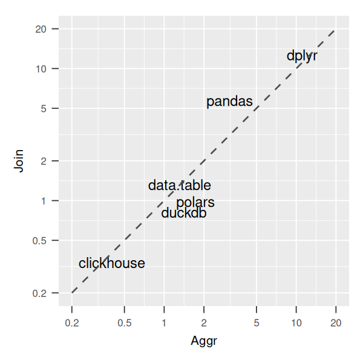

### Simple/basic/limited/incomplete benchmark for operations on tabular data (aggregates and joins)

For structured/tabular/relational data most transformations for data analysis are based on a few
primitives. Computationally, aggregates and joins are taking the majority
of time. This project aims at a *minimal* benchmark of a few popular tools 
for working with tabular data of moderately
large sizes (but still within the reach of interactive data analysis - response times
of a few seconds on a commodity server/desktop or even a laptop).

This project is the continuation of my [similar benchmark](https://github.com/szilard/benchm-databases) from 10 years ago.


#### Tools

The tools analysed are statistical/data analysis software/libraries (R data.table, R dplyr, python's pandas, polars from python), an embedded analytical database engine (duckdb from python) and a columnar database (clickhouse). All are open source and readily available.

- R data.table
- R dplyr
- duckdb
- python's pandas
- polars (from python)
- clickhouse

We know from the previous old [benchmark](https://github.com/szilard/benchm-databases)
that traditional SQL databases (e.g. mysql, postgres) are terribly slow at these operations/sizes (100x slower). We also know that the big data tools (e.g. hive, spark) are also super slow (100x). The previous benchmark found that a couple of commercial MPPs/columnar databases are pretty decent, however with good open source tools (e.g. clickhouse) available now in that space, there is no reason to include them anymore. So, all the later tools are excluded from this benchmark.


#### Data

The data used is [synthetic](generate_data.R): 
one table `d` (`x` integer, `y` float) of 100 million rows for aggregation
(`x` takes 1 million distinct values) and another table `dm` (`x` integer) of 1 million rows for the join only.
The larger table `d` is of ~2GB size in the CSV format and results in ~1GB usage when loaded in memory.


#### Transformations

In each tool we implement aggregations and joins that correspond to these SQL queries:

```
select x, avg(y) as ym 
from d 
group by x
order by ym desc 
limit 5;
```

and

```
select count(*) as cnt 
from d
inner join dm on d.x = dm.x;
```


#### Setup

The tests have been performed on a m8i.2xlarge EC2 instance (8 cores, 32GB RAM) running Ubuntu 24.04.
You can actually get nowadays similar timings on a decent laptop (and also unlike 10+ years ago, 
this data will now fit in your laptop's memory).

The easiest way to run the benchmark is to use docker and the provided [Dockerfile](Dockerfile) and then:
```
sudo docker build -t dataframe-benchmark .
sudo docker run dataframe-benchmark
```


#### Limitations

This is far from a comprehensive benchmark. It is my attempt to *quickly* get an idea of the order
of magnitude of running times for aggregations and joins on datasets of sizes of interest to *me* at the moment. 
The results are expected to vary with hardware, dataset size, structure etc.
In addition, one might say that data operations/queries in real practice are more complex and their running times depend not only 
on how fast are these primitives, but also on how the query planner/optimizer (if applicable) can deal with the given complexity. Again,
a comprehensive SQL benchmark is out of scope here (but see e.g. TPC-DS).


#### Results

Run times in seconds:

| Tool | Aggr.| Join |
|------|-------------|------|
| data.table | 1.31 | 1.32 |
| dplyr | 11.1 | 12.7 |
| duckdb | 1.41 | 0.817 |
| pandas | 3.14 | 5.72 |
| polars | 1.73 | 0.983 |
| clickhouse | 0.402 | 0.339 |

Plotted on log scales:




#### Discussions

When choosing a tool for data analysis, performance is only one of the criteria. Other factors include ease of use, 
ecosystem, integration with other tools, community support, learning curve etc. However, performance matters, especially when dealing with larger datasets since fast tools allows you to explore the data more interactively and iterate quickly. 

If you have data of similar sizes (100 million rows/a few GBs of data), based on the above results and also on my own 
experience, if you are using R, I would recommend data.table (also because of the concise syntax and great features). If you use python, polars is faster than pandas (though none of them have a great syntax). If you prefer to write SQL, duckdb is a great embedded analytical database engine (virtually zero setup) that can be used from both R or python. Finally, if you don't mind the extra work of setting up and maintening a database server (and again you like SQL), clickhouse is a great choice. 